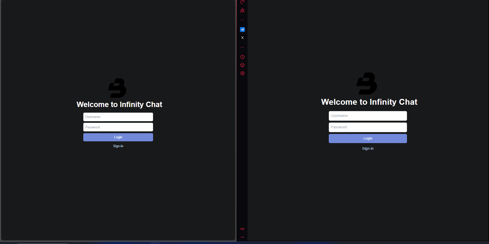

# Infinity Chat Frontend

This is the frontend part of the Infinity Chat project.

### [DEMO](https://infinity-chat-frontend.vercel.app)



## Getting Started

### Prerequisites

- Node.js (v14 or higher)
- npm or yarn

### Installation

1. Clone the repository:

   ```bash
   git clone https://github.com/gabrielpdev/infinity-chat-frontend.git
   cd infinity-chat-frontend
   ```

2. Install dependencies:

   ```bash
   npm install
   # or
   yarn install
   ```

### Running the Development Server

```bash
npm run dev
# or
yarn dev
```

Open [http://localhost:3000](http://localhost:3000) with your browser to see the result.

### Environment Variables

Create a `.env` file in the root of the `frontend` directory and add the following environment variables:

```
NEXT_PUBLIC_BACKEND=http://localhost:3000 or your backend url
```

## Learn More

To learn more about Next.js, take a look at the following resources:

- [Next.js Documentation](https://nextjs.org/docs) - learn about Next.js features and API.
- [Learn Next.js](https://nextjs.org/learn) - an interactive Next.js tutorial.
